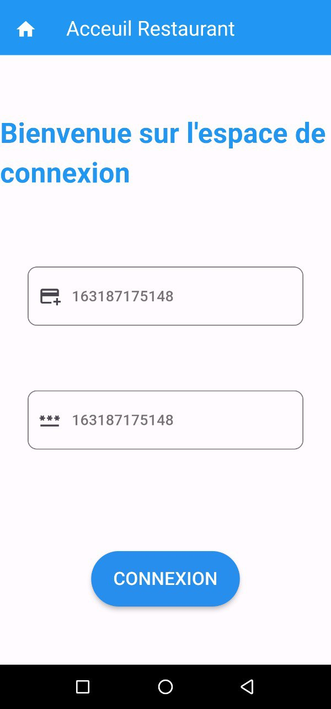
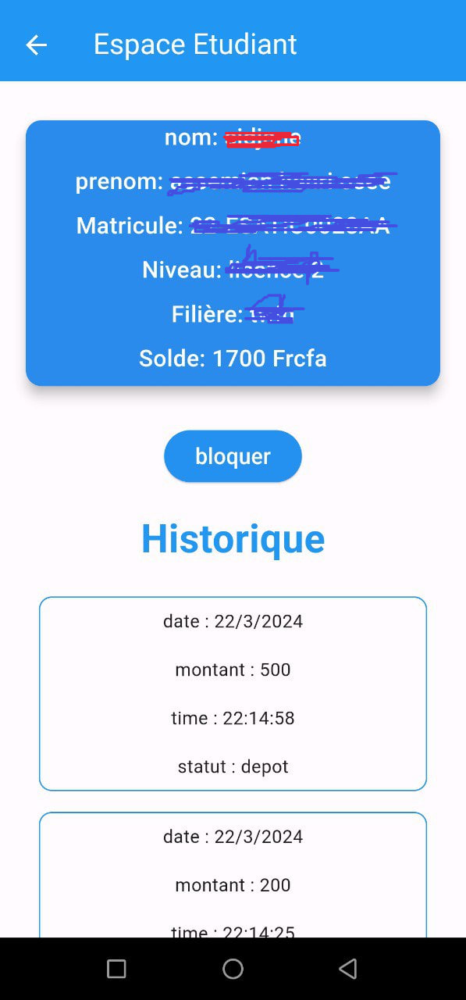
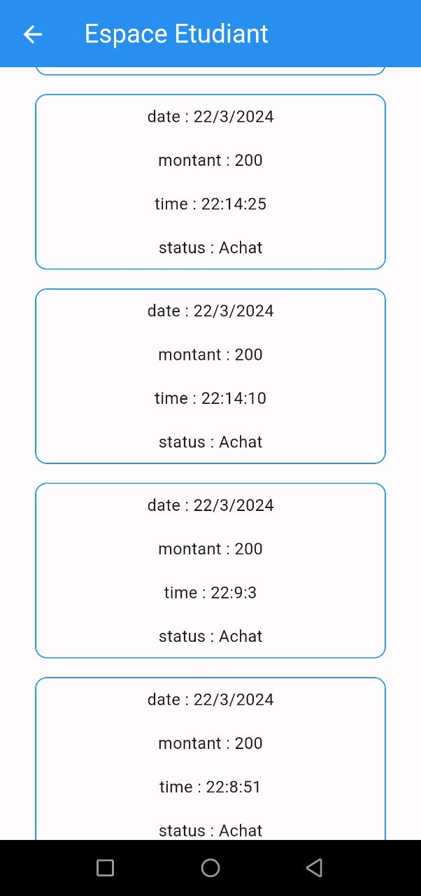

<h1>Restaurant Esatic Client</h1>

<h3>Description</h3>
Restaurant Esatic Client est une application de gestion de carte de restauration conçue pour les utilisateurs. Que vous soyez un client régulier ou occasionnel, cette application vous permet de parcourir facilement voir votre solde et bien plus encore. Avec une interface conviviale et des fonctionnalités intuitives, Restaurant Esatic Client vous offre une expérience agréable et pratique lors de votre visite au restaurant.

## Captures d'écran

<h3>Page de connexion</h3>

<h3>Page d'acceuil utilisateur</h3>

<h3>Licence</h3>

Ce projet est sous licence MIT - voir le fichier <a href="LICENSE">LICENSE</a> pour plus de détails.
